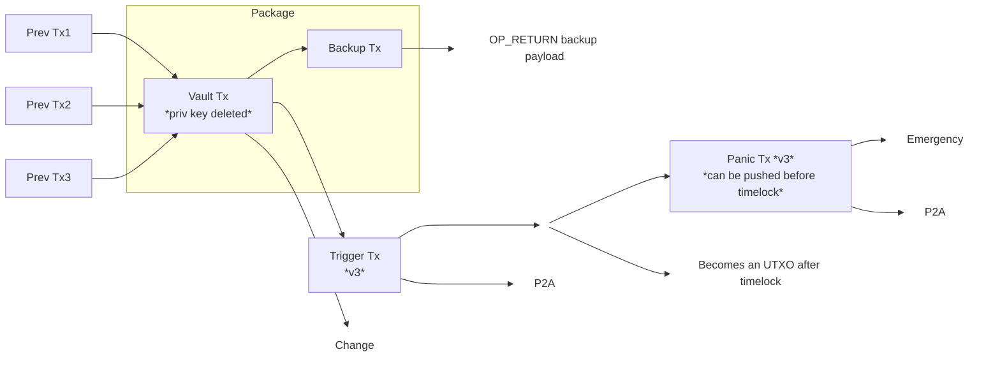
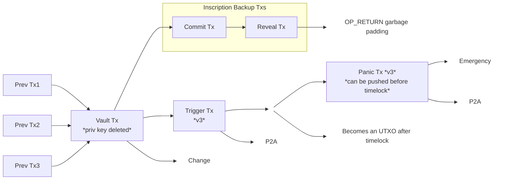

# On-chain Wallet Backup Strategies

This document explores on-chain backup strategies for Bitcoin wallets, with a
focus on what will be the next version of Rewind Bitcoin (Rewind 2). Many of the
techniques are applicable to other wallets.

The goal is that a user can restore a wallet on a fresh device using only the
12-word BIP39 mnemonic, without needing extra digital backups.

Because Rewind 2 is a vault-enabled wallet, this document first refreshes what
Bitcoin vaults are and then dives into the backup techniques.

The code that accompanies this document can be run by clicking the [**SHOW
PLAYGROUND**](https://bitcoinerlab.com/guides/rewind2) button on
BitcoinerLAB.com or by [installing and running the code
locally](https://github.com/bitcoinerlab/playground).

## Vaults: quick recap

A vault-enabled wallet locks funds to a setup-only key and then destroys that
key. Before deletion, it pre-signs a small, fixed transaction set, so
later spending can only follow those pre-committed ways (covenant-like in
effect).

To move funds out, you broadcast a pre-signed **trigger** (unvault) transaction.
The trigger creates an intermediate output where the "normal spend" path is
gated by a **relative timelock**.

If the trigger is unexpected (an attacker got access to your wallet), you (or a
delegated person) can broadcast another pre-signed **panic** (rescue/cancel)
transaction that _spends the trigger's output_ immediately to an emergency cold
destination, without waiting out the timelock.

## Background

Past proposals (including Rewind 1) experimented with centralized or
[P2P-style backups](https://rewindbitcoin.com/community-backups). These
designs shift the burden to users and depend on external services. The approach
explored here avoids that dependency by storing the backup payload on-chain.
This is a controversial tradeoff, but this document focuses strictly on the
available technology and its constraints.

## What a vault wallet needs

A vault-enabled wallet is defined by three pieces of data:

1. A 12-word BIP39 mnemonic
2. Two pre-signed transactions: the **trigger** and **panic** transactions
3. A small set of descriptors

The trigger and panic transactions are the payload that must be backed up (after
encryption). Rewind 2 uses deterministic, opinionated descriptors, so they do
not need to be saved separately. A future direction is to back up descriptors
using the same on-chain techniques described here.

Since trigger/panic txs are required, on-chain commitment enables restore from
mnemonic alone.

## Strategies

Below are the three on-chain backup approaches Rewind 2 evaluates, with their
tradeoffs and policy constraints.

### OP_RETURN + TRUC

TRUC is a newer relay policy (active since Bitcoin Core 28) that lets you submit
small 1‑parent‑1‑child packages as a unit, allowing 0‑fee parents when the child
pays enough.

This strategy uses a two‑tx package where the vault transaction is the parent
and the OP_RETURN backup transaction is the child. It stores the backup payload
in a single OP_RETURN transaction and uses TRUC rules to link it to the vault
transaction (the one with the to‑be‑deleted setup key). See the flow diagram
below.

Pros:

- Parent (`Vault Tx`) can be 0‑fee, allowing fee shifting to the backup
  transaction and ensuring (in practice) that a vault is not created unless the
  backup exists. Miners could still include a 0‑fee parent without a subsidizing
  child but it is unlikely in practice.

Cons:

- TRUC has tighter rules than regular v2 transactions; for example, funding
  inputs (`Prev Txs`) must be confirmed before creating the package.

### OP_RETURN + v2 (non-TRUC)

Same OP_RETURN payload, but using v2 regular transactions. Fee shifting still
works, but the vault transaction must pay the static min-relay fee (`0.1
sats/vB`) and the final backup transaction bumps the effective fee rate via CPFP
(Child Pays for Parent).

Pros:

- Simpler policy model, no TRUC restrictions.
- The `Vault Tx` funding inputs (`Prev Txs`) do not need confirmation before
  creating the vault + backup package. This makes testnet demos much faster since
  a full backup can be done in seconds after faucet funding instead of waiting for
  a block.

Cons:

- Each transaction must meet the static min-relay fee (`0.1 sats/vB`)
  individually.
- A 0-fee parent is rejected even in a package, so fee shifting is limited.

### Inscriptions

Inscriptions use a commit+reveal chain with the payload in the reveal
transaction witness. Fee shifting uses minimum relay fees on the vault/commit
transactions and a higher‑fee reveal transaction for CPFP.

The reveal transaction creates a small OP_RETURN padding output. The padding
is just garbage data used to avoid Core's `tx-size-small` policy (non‑witness
size >= 65 bytes).

Pros:

- Cheaper than OP_RETURN for payloads [over 142
  bytes](https://bitcoin.stackexchange.com/questions/122321/when-is-op-return-cheaper-than-op-false-op-if)
  (which is often the case).

Cons:

- The dependency chain becomes `Vault → Commit → Reveal` when the vault funds
  the backup.
- `submitpackage` (Core RPC) only accepts _child-with-parents_ packages, where
  all parents are direct parents of the final child and cannot depend on each
  other. This chain introduces a grandparent, so it cannot be submitted as a
  package.
- Relay is non-atomic: transactions must be pushed sequentially, though CPFP
  still applies to the chain once broadcast.

## Fee shifting to the end of the chain

This section dives a bit deeper on fee‑shifting and why it improves backup
reliability.

To maximize the odds that the backup is mined, Rewind 2 shifts most fees to the
end of the backup chain. The vault transaction pays only the minimum relay fee
(or zero for TRUC) and the final backup transaction raises the effective fee
rate via CPFP. This means:

- The backup has the economic incentive to be mined.
- The vault is only mined because the backup pays the subsidy.
- This is especially valuable for OP_RETURN_TRUC, where a 0-fee parent is
  policy-valid when the child pays enough.

## Vault Design Details

This section focuses on the vault‑specific aspects of the on‑chain backup
design.

### Fee Anchors for Trigger and Panic (P2A)

The trigger and panic transactions include a P2A output, a bare script that
creates an anyone‑can‑spend anchor. These transactions are pre‑signed at setup
time, but the fee environment at broadcast time is unknown. A P2A anchor lets
the wallet attach a child transaction later to bump the effective feerate via
CPFP, without changing the pre‑signed tx. This keeps the pre‑signed path valid
while still allowing fee adjustment when it's actually needed.

### Vault Output Ordering

The vault transaction uses deterministic output ordering so the wallet can
identify vaults and enumerate how many exist.

- Output 0: The output that feeds the trigger transaction.
- Output 1: A deterministic vault marker output used to fund the backup.

Each vault uses a unique index derived from the wallet seed. The marker output
is sent to a pubkey derived from the path `m/1073'/<network>'/0'/<index>`, where
`<network>` is `0` for mainnet and `1` for test networks and `<index>` starts at
0 and increments for each new vault.

To create a new vault, the wallet scans these indices, detects which ones are
already used and selects the next unused index. This lets the wallet discover
and count all vaults just by checking which deterministic vault paths have been
used, without any extra metadata.

### Backup Encryption

WIP
