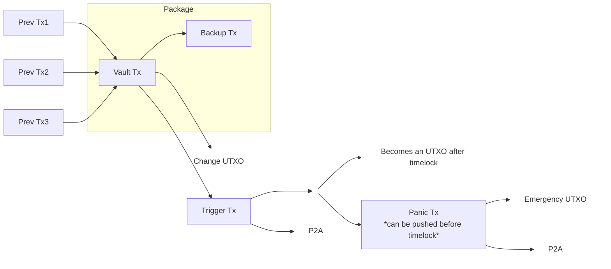
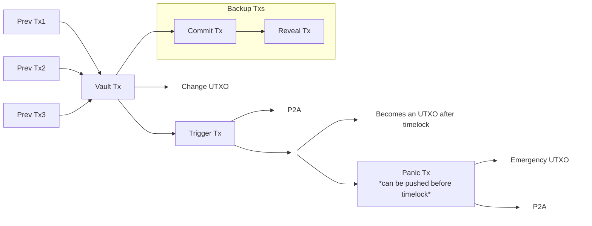

# On-chain Wallet Backup Strategies

This document explores on-chain backup strategies for Bitcoin wallets, with a
focus on Rewind 2. Many of the techniques are applicable to other wallets.

The goal is that a user can restore a wallet on a fresh device using only the
12-word BIP39 mnemonic, without needing extra digital backups.

Because Rewind 2 is a vault-enabled wallet, this document first refreshes what
Bitcoin vaults are and then dives into the backup techniques.

The code that accompanies this document can be run by clicking the **SHOW
PLAYGROUND** button on bitcoinerlab.com or by [installing and running the code
locally](https://github.com/bitcoinerlab/playground).

## Vault refresher

A vault-enabled wallet locks funds to a setup-only key and then destroys that
key material. Before deletion, it pre-signs a small, fixed transaction set, so
later spending can only follow those pre-committed ways (covenant-like in
effect).

To move funds out, you broadcast a pre-signed **trigger** (unvault) transaction.
The trigger creates an intermediate output where the "normal spend" path is
gated by a **relative timelock**.

If the trigger is unexpected (an attacker got access to your wallet), you can
broadcast another pre-signed **panic** (rescue/cancel) transaction that _spends
the trigger's output_ immediately to an emergency cold destination, without
waiting out the timelock.

## Background

Past proposals (including Rewind Bitcoin v1) experimented with centralized or
P2P-style backups: <https://rewindbitcoin.com/community-backups>

Those designs depend on external services. The approach explored here avoids
that dependency by storing the backup payload on-chain. This is a controversial
tradeoff, but this document focuses strictly on the available technology and its
constraints.

## What a vault wallet needs

A vault-enabled wallet is defined by three pieces of data:

1. A 12-word BIP39 mnemonic
2. Two pre-signed transactions: the **trigger** and **panic** transactions
3. A small set of descriptors

The trigger and panic transactions are the payload that must be backed up.
Rewind 2 uses deterministic, opinionated descriptors, so they do not need to be
saved separately. A future direction is to back up descriptors using the same
on-chain techniques described here.

## Why on-chain backups

Private keys alone are not enough to restore a vault wallet on a fresh device.
The trigger and panic transactions must also be available. By committing them
on-chain, the user can restore the wallet state using only the mnemonic, without
keeping extra digital backups around.

## Strategies

### OP_RETURN + TRUC (v3)

Store the backup payload inside a single OP_RETURN transaction and use v3/TRUC
rules to link it to the vault.

Pros:

- Parent can be 0-fee, allowing fee shifting to the backup transaction and
ensuring the backup is mined in practice (no vault without a backup).
- Works well with CPFP: the backup can pay the fee for both transactions.

Cons:

- TRUC restrictions: funding inputs must be confirmed before creating the
package.
- TRUC has tighter rules than regular v2 transactions.

### OP_RETURN + v2 (non-TRUC)

Same OP_RETURN payload, but using v2 regular transactions. Fee shifting still
works, but the vault transaction must pay the static min-relay fee (0.1 sats/vB)
and the final backup transaction bumps the effective fee rate via CPFP.

Pros:

- Simpler policy model, no TRUC restrictions.
- Funding UTXOs do not need confirmation before creating the backup. This makes
demos on test networks much faster, since a full backup can be done in seconds
instead of waiting for a block.

Cons:

- Each transaction must meet the static min-relay fee individually.
- A 0-fee parent is rejected even in a package, so fee shifting is limited.

### Inscriptions

Use a two-transaction commit/reveal inscription to carry the backup payload. Fee
shifting uses the minimum relay fee on the vault/commit transaction and a
higher-fee reveal to bump the effective rate via CPFP.

Pros:

- Fits in the inscription ecosystem.
- Cheaper than OP_RETURN in most cases:
<https://bitcoin.stackexchange.com/questions/122321/when-is-op-return-cheaper-than-op-false-op-if>

Cons:

- The dependency chain becomes `Vault → Commit → Reveal` when the vault funds
the backup.
- `submitpackage` only accepts _child-with-parents_ packages, where all parents
are direct parents of the final child and cannot depend on each other. This
chain introduces a grandparent, so it cannot be submitted as a package.
- Relay is non-atomic: transactions must be pushed sequentially.

## Package policy constraints

Package relay is constrained by `submitpackage` rules:

- Packages must be _child-with-parents_ only.
- Parents cannot depend on each other (no grandparents unless also direct
parents of the child).
- Transactions are validated individually before package policy is applied.

These rules are why a 3-transaction inscription chain cannot be submitted as a
single package, while the 2-transaction OP_RETURN chain can.

## Fee shifting to the end of the chain

To maximize the odds that the backup is mined, Rewind 2 can shift most fees to
the end of the backup chain. The vault transaction pays only the minimum relay
fee (or zero for TRUC), and the final backup transaction raises the effective
fee rate via CPFP. This means:

- The backup has the economic incentive to be mined.
- The vault is only mined because the backup pays the subsidy.
- This is especially valuable for OP_RETURN_TRUC, where a 0-fee parent is
policy-valid when the child pays enough.

## Transaction Flow Diagrams

### OP_RETURN flow (packageable)

This flow applies to OP_RETURN backups (v2/v3), where the vault and backup
transactions can be submitted as a package.

### Inscription flow (non-packageable)

Inscriptions use a commit+reveal chain, so the backup consists of two
transactions and cannot be submitted as a single package.

## Vault Output Ordering

The vault transaction uses deterministic output ordering so the wallet can
identify vaults and enumerate how many exist.

- Output 0: The output that feeds the trigger transaction.
- Output 1: A deterministic vault marker output used to fund the backup.

Each vault uses a unique index derived from the wallet seed. The marker output
is sent to a pubkey derived from the path `m/1073'/<network>'/0'/<index>`, where
`<network>` is `0` for mainnet and `1` for test networks, and `<index>` starts
at 0 and increments for each new vault.

To create a new vault, the wallet scans these indices, detects which ones are
already used, and selects the next unused index. This lets the wallet discover
and count all vaults just by checking which deterministic vault paths have been
used, without any extra metadata.
