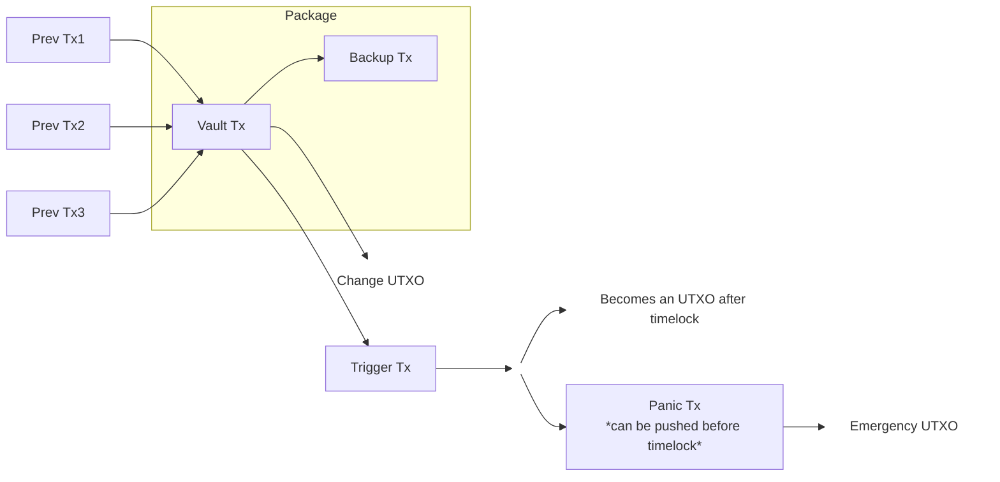

# Rewind 2 Architecture

## Design Decision: OP_RETURN vs. Inscriptions

Rewind 2 utilizes `OP_RETURN` for storing backup data, prioritizing transaction reliability and atomicity over economic optimization (which might favor Inscriptions).

### Motivation: Atomicity

The primary goal is to ensure the **Vault Transaction** and the **Backup Transaction** are mined atomically. We must avoid a scenario where a Vault is created (funds locked) but the Backup fails to confirm, which would lead to a loss of data required to recover the funds.

To achieve this, the Vault and Backup transactions should ideally be submitted and mined as a package.

### Constraint: Bitcoin Core Package Relay Limits

To support package relay and potentially utilize TRUC (Topologically Restricted Until Confirmation) v3 transactions, we must adhere to Bitcoin Core's package limits.

Current/upcoming Bitcoin Core versions (e.g., v30.2 logic) typically restrict packages to a specific topology, often allowing **one child with its parents**, but prohibiting long chains of unconfirmed dependencies within a single package submission if they exceed specific depth/size limits.

### Analysis

#### The Inscription Approach (Rejected)

Using Inscriptions for backups requires two transactions:

1.  **Commit Transaction**
2.  **Reveal Transaction**

If the Vault pays for the Backup (to ensure linkage/atomicity), the dependency chain becomes:
`Vault Tx` $\rightarrow$ `Commit Tx` $\rightarrow$ `Reveal Tx`

This results in a chain of **3 transactions**. This exceeds standard package relay limits for unconfirmed transaction chains (often limited to 2 for TRUC/V3 or specific package submission rules).

#### The OP_RETURN Approach (Selected)

Using `OP_RETURN` allows the backup to be contained within a single transaction (or potentially the Vault transaction itself). If implemented as a separate child transaction paid for by the Vault:
`Vault Tx` $\rightarrow$ `Backup Tx (OP_RETURN)`

This results in a chain of **2 transactions**. This fits comfortably within package relay limits, allowing the Vault and Backup to be propagated and mined together reliably.

### Transaction Flow Diagram

